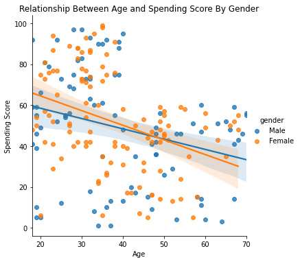
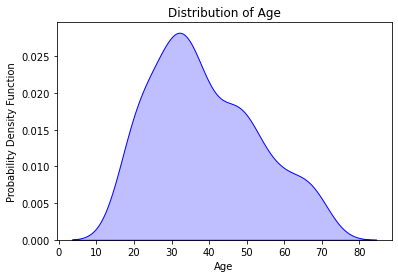
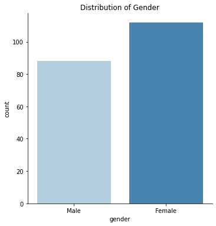
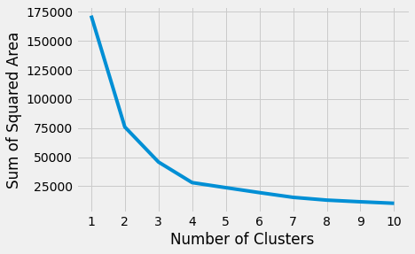
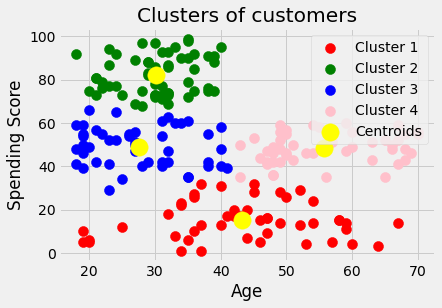
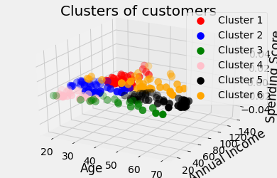

# Mall Customers Clustering: Project Overview 
- Grouped mall customers into cluster using three different combinations of customer metrics
- Created visualisations of the created clusters

# Exploratory Data Analysis and Data Visualisation
- Dropped all rows with null values and all duplicates
- Changed column names for simplicity

# Model Building
### I created three different versions of the customers, using variations of the given metrics ###
#### Looked at scree plot to determine the optimal number of clusters ####

- Age and spending score: 4 clusters (low spending score, young and high spending score, young and medium spending score, old and medium spending score)

- Annual income and spending score: 5 clusters(low income and low spending score, medium income and medium spending score, high income and high spending score, low income and high spending score, high income and low spending score)

- Age, annual income, and spending score: 6 clusters(old/low income/low spending score, medium age/low spending score/high income, old/medium spending score/medium income, medium age/medium spending score/medium income, young/high spending score/low income, young/high spending score/high income)

